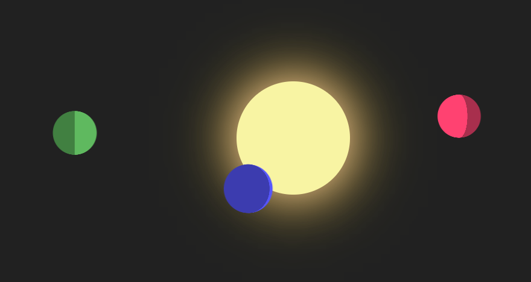

# nodejs-css-planets

# Images

# License
Please see [Apache 2.0 License](./LICENSE) for details

# Work Cited
Kubow, Ania. “Rotating Planets in JUST CSS!!! Simple Tutorial.” <i>Youtube</i>, Youtube, 7 September 2022, 
    https://www.youtube.com/watch?v=6M-rZIukXy0. Accessed 30 September 2022.